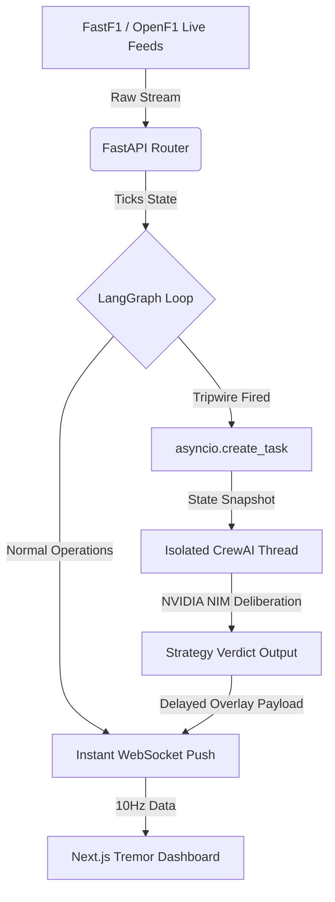

Here is the complete, production-ready project blueprint structured as a comprehensive Markdown documentation file.

You can save this file as `F1_AI_TELEMETRY_BLUEPRINT.md` on your MacBook. This document contains zero placeholders and explicitly outlines our architecture, technical stack decisions, and implementation plan. It is specifically designed to get any clean-context AI agent (like Cursor, Devin, or a Copilot agent) perfectly aligned with our current engineering design.

---

```markdown
# Blueprint: Live Motorsports Edge Telemetry & AI Strategist (V1)

## 1. Project Intent & Scope
The objective is to build a high-performance, real-time F1 telemetry visualization and agentic strategy dashboard. The system processes massive, high-frequency structured data streams (10Hz telemetry updates) alongside unstructured, low-frequency event streams (team radio transcriptions and race control texts). 

To maximize intelligence while minimizing cloud compute expenses, the system relies on localized infrastructure for data processing and NVIDIA NIM API for inference. 

## 2. Target Production Infrastructure
While initial development takes place locally on a MacBook, the code must be written with clean separation to immediately hand off to a production environment.
* **Backend Hosting:** Oracle Cloud Always-Free ARM VM (4 cores, 24GB RAM) — runs FastAPI + Turbovec side-by-side at zero cost.
* **Inference Engine:** NVIDIA NIM API keys (remote inference, no local model hosting required).
* **Vector Store:** Turbovec (self-hosted on the Oracle Cloud VM) for embedding and querying historical context and team radio transcripts.
* **Frontend Hosting:** Vercel (Free Tier).

## 3. Core Software Stack
* **Frontend Dashboard:** Next.js (React), Tremor (Data-dense components and layout), TailwindCSS.
* **API Server:** FastAPI using native asynchronous WebSockets for fluid data transmission.
* **Workflow State Machine:** LangGraph (Handles real-time data loops and state mutations).
* **Multi-Agent Deliberation:** CrewAI (Triggered ad-hoc for complex multi-agent reasoning).
* **Ingestion Clients:** `FastF1` (High-frequency car mechanics) and `OpenF1` API (Race control data).

---

## 4. Architectural Philosophy: Asynchronous Non-Blocking Overlay
A fatal flaw in real-time streaming architectures is invoking an LLM directly inside the main data loop. Because token generation takes seconds, blocking the thread would drop dozens of critical telemetry packets, causing data gaps on the dashboard.

### The Correct Structural Pattern:
1. **The Ingestion Highway:** LangGraph constantly pulls, updates, and streams raw telemetry data to the frontend over WebSockets at 10Hz. This loop is deterministic Python code and never sleeps or blocks.
2. **Deterministic Tripwires:** The LangGraph loop contains mathematical mathematical bounds (e.g., Z-score thresholding on pace drops, tracking throttle micro-divergences, or regex pattern matching on race control texts).
3. **Asynchronous Spawning:** The exact millisecond a tripwire triggers, LangGraph duplicates the exact `RaceState` at that frame, and fires a non-blocking background task using `asyncio.create_task()`.
4. **CrewAI Execution:** The background thread activates the CrewAI agents to debate the anomaly using NVIDIA NIM API inference. The main 10Hz stream continues perfectly uninterrupted.
5. **The Overlay:** Once CrewAI finishes its deliberation (approx. 3-5 seconds), it pushes a custom payload containing the strategic insight over the active WebSocket, overlaying the analysis onto the dashboard.



---

## 5. Directory Structure Blueprint

To allow seamless migration from MacBook development to the Oracle Cloud VM without rewriting frontend paths, enforce this strict structural boundaries:

```text
f1-telemetry-ai/
├── .gitignore
├── README.md
├── frontend/                  # Deployed to Vercel
│   ├── package.json
│   ├── app/                   # Next.js app router & layouts
│   └── components/            # Tremor visualization cards & terminal overlay
└── backend/                   # Deploys to Oracle Cloud VM
    ├── requirements.txt
    ├── main.py                # FastAPI initialization & WebSocket management
    ├── graph.py               # LangGraph schema, state variables, & tripwire math
    └── agents.py              # CrewAI agent profiles, tools, and tasks

```

---

## 6. Phase 1 Implementation Guide for the Agent

To verify the end-to-end framework connectivity, execute **Phase 1** exactly as detailed below on the local host.

### Step 1: Initialize Project Structure

Run the following terminal commands to prepare the workspaces:

```bash
mkdir f1-telemetry-ai && cd f1-telemetry-ai
mkdir backend
npx create-next-app@latest frontend --typescript --tailwind --app --eslint

```

### Step 2: Establish the Mock Async Backend

Inside `backend/requirements.txt`, install dependencies:

```text
fastapi
uvicorn
langgraph
crewai
openai                       # SDK for NVIDIA NIM API calls
python-dotenv               # Load API keys from .env

```

**Environment Variable:** `NVIDIA_NIM_API_KEY` (add to `.env` in the backend directory)

Create `backend/main.py` using `asyncio` loop architectures to demonstrate non-blocking execution:

```python
import asyncio
import json
from fastapi import FastAPI, WebSocket
from fastapi.middleware.cors import CORSMiddleware

app = FastAPI()

app.add_middleware(
    CORSMiddleware,
    allow_origins=["*"],
    allow_credentials=True,
    allow_methods=["*"],
    allow_headers=["*"],
)

async def simulated_crewai_worker(snapshot_lap: int, websocket: WebSocket):
    """Simulates asynchronous multi-agent deliberation without blocking telemetry."""
    await asyncio.sleep(4.0) # Simulate local LLM processing lag
    verdict = {
        "type": "AI_STRATEGY_OVERLAY",
        "content": f"CRITICAL OVERLAY (Lap {snapshot_lap}): CrewAI detected sudden pace drop. Recommended path: Box this lap for Hard tires."
    }
    await websocket.send_text(json.dumps(verdict))

@app.websocket("/ws/race")
async def websocket_endpoint(websocket: WebSocket):
    await websocket.accept()
    lap = 1
    tick = 0
    
    try:
        while True:
            await asyncio.sleep(0.1) # Strict 10Hz loop
            tick += 1
            
            # Simulated Telemetry Frame
            telemetry_payload = {
                "type": "TELEMETRY_TICK",
                "lap": lap,
                "speed": 310 + (tick % 10),
                "rpm": 11800 + (tick % 100),
                "tyre_wear": round(0.01 * tick, 2)
            }
            await websocket.send_text(json.dumps(telemetry_payload))
            
            # Simulate a mathematical tripwire event firing at a specific milestone
            if tick == 50:
                # Trigger background task asynchronously
                asyncio.create_task(simulated_crewai_worker(lap, websocket))
                
            if tick >= 100:
                lap += 1
                tick = 0
    except Exception as e:
        print(f"Client disconnected: {e}")
    finally:
        await websocket.close()

if __name__ == "__main__":
    import uvicorn
    uvicorn.run(app, host="0.0.0.0", port=8000)

```

### Step 3: Implement Frontend WebSocket Consumer

Inside `frontend/app/page.tsx`, establish a WebSocket hook that updates state dynamically. Ensure the visual metrics refresh continuously, and render incoming `AI_STRATEGY_OVERLAY` messages inside a separate notification toast layer.

---

## 7. Immediate Next Steps for the Development Agent

1. Spin up the FastAPI server locally on port `8000`.
2. Build out a data-dense Tremor dashboard displaying live fluctuating parameters (Speed, RPM, Wear).
3. Confirm that when the counter simulates an anomaly, the live charts continue updating fluently while the text message pops into the feed exactly 4 seconds later.

```

---

### What to do now:
Copy the block above, save it into your new project directory, and pass it directly to your code editor's agent tool. You can instruct it with: *"Read this architectural document carefully. Let's begin implementing Phase 1 by setting up the codebase and verifying our non-blocking WebSocket loop."*

```